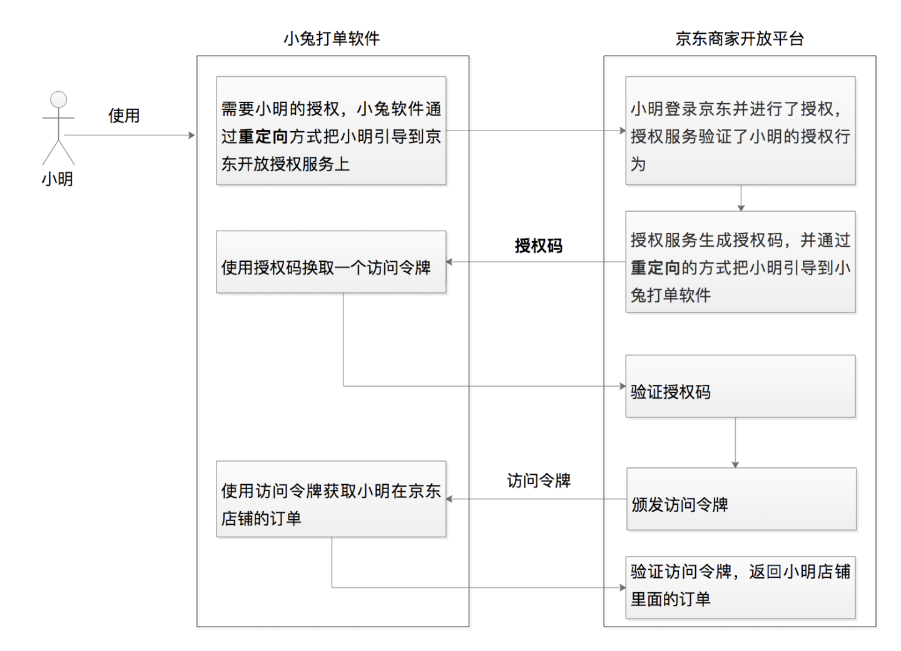
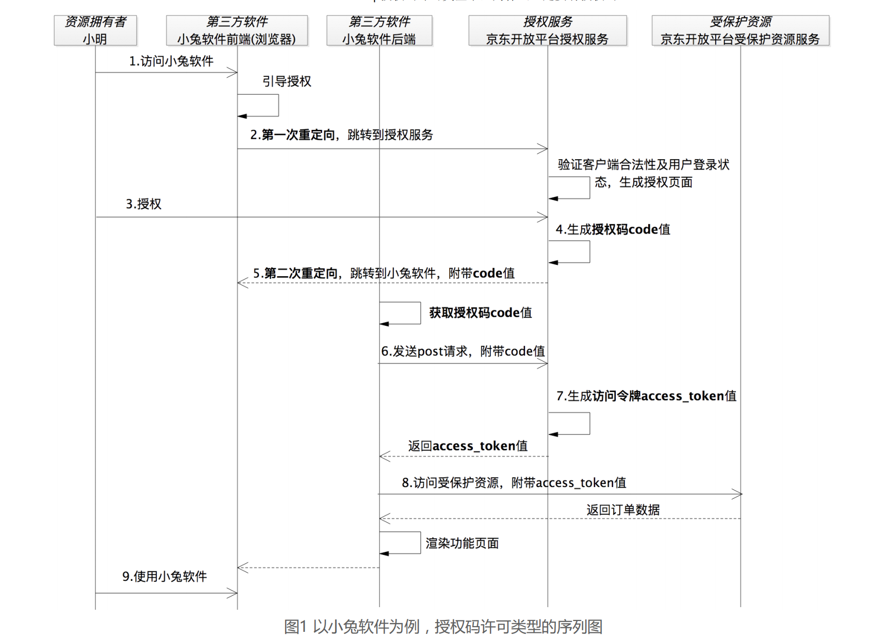
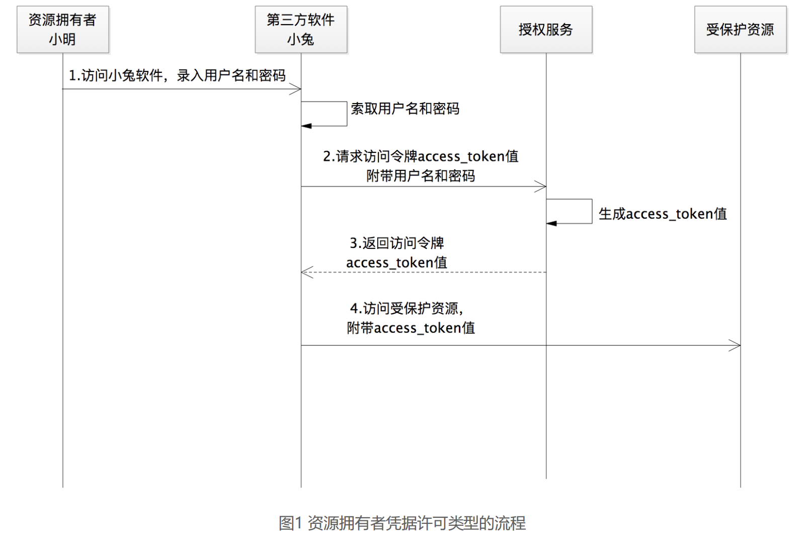
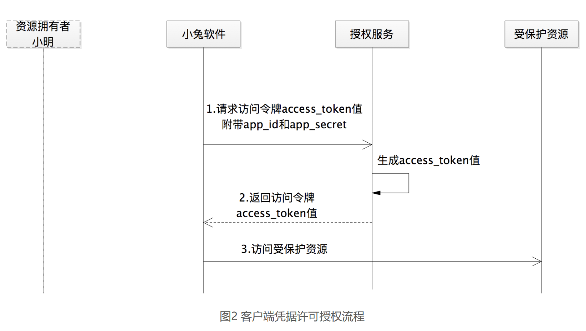

# Oauth2.0

第三方软件，需要微信登录，使用微信的头像和用户名等场景，都需要Oauth2.0授权。

**授权码许可类型**

小明在京东商城上开了一家店铺，现在需要使用小兔软件，打印店铺的订单列表，这就需要京东开发平台授权小兔软件获取。流程如下：

Oauth2.0的核心就是颁发授权码，通过授权码颁发访问令牌。

Oauth2.0中有四个角色：资源拥有者（小明）、第三方软件（小兔软件）、授权服务（京东开放平台）、受保护资源（小明店铺的订单）。

为什么Oauth2.0需要授权码，而不是直接返回访问令牌？

答：第一次重定向之后，用户与第三方软件就失去了联系，需要第二次重定向进行建立联系，而第二次重定向会授权码暴露在浏览器上，会有一定的安全风险，因此需要授权码这个临时的令牌，而不能返回访问令牌，而是由第三方软件后端通过授权码去开放平台，获取访问令牌。

必须要有浏览器代理吗？

不是必须，比如微信小程序，是有小程序前端调用微信提供的SDK，实现获取到登录凭证code。再由后端程序通过code换取访问令牌。

工作流程：

1. 小兔软件，需要到开放平台注册，包括基本信息、权限、重定向url，同时生成client_id、client_secret；
2. 准备阶段，授权之前，第一次重定向，开放平台需要验证小兔软件前端调用url的参数：scope、重定向url、client_id、client_secret，验证软件是否存在、scope是否越权、**生成授权请求页面**。
3. 小明选择scope，授权之后，开放平台需要二次验证scope、生成授权码auth_code，建立auth_code、user、client_id的绑定关系，同时绑定scope信息；
4. 生成授权码之后，通过重定向url+auth_code返回给浏览器；
5. 第三方软件拿到auth_code，后端申请访问令牌，开放平台确认过auth_code后，立刻从存储中删除auth_code，建立access_toke与user、client、scope之间的关联关系，同时设置过期时间。
6. 第三方软件通过访问令牌获取订单列表；

如果第三方软件访问过程中，access_token失效了怎么办？

Oauth2.0引入了刷新令牌refresh_token。用户在access_token过期之后不需要重新授权，可以继续使用第三方软件。

refresh_token、access_token是同时颁发给第三方软件的。刷新令牌的目的是：在访问令牌失效的情况下，不需要用户重新授权，通过系统重新请求生成一个新的访问令牌。

以上的流程，是第三方软件与授权服务的交互，适用于第三方软件与授权服务不是同一系统。

**资源拥有者凭据许可类型**

那么如果小兔软件，是京东自家的，是被京东充分信任的，没有第三方软件的概念，这时就没必要使用授权码许可类型进行授权了。Oauth2.0还提供了资源拥有者凭据许可类型，资源拥有者的凭据，也就是用户名和密码。使用token代替用户名和密码等敏感信息数据。

**客户端凭据许可**

如果小兔软件访问了一个不需要小明授权的数据，比如获取京东的LOGO图片地址，这个LOGO信息不属于任何一个用户。此时需要使用客户端凭据许可，第三方软件可以直接使用注册的client_id和client_secret来换回访问令牌。

**隐式许可**

如果小明软件没有后端服务，纯粹的js应用。这种情况，直接生成token返回给浏览器即可。

**建议**

对接Oauth2.0的时候，优先考虑授权码许可类型； auth_code -> access_token

如果小兔软件是官方出品，那么可以直接使用资源拥有者凭证许可； user+password -> access_token

~~如果小兔软件是嵌入在浏览器中的，没有后端服务，可以使用隐式许可；~~

如果小兔软件获取的信息不属于任何一个第三方用户，可以直接使用客户端凭据许可类型；client_id+client_secret -> access_token
